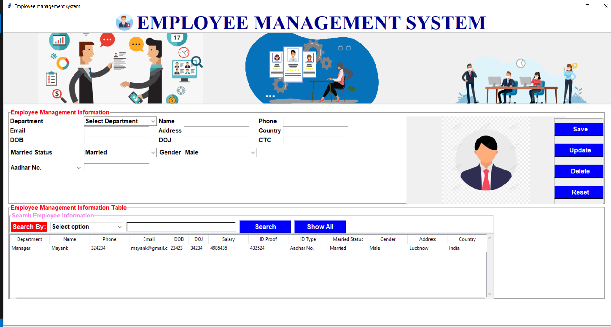

# Employee_management_system
## Python project made in collabration with coding blocks.

# Prerequisites
- Python
- MySQL

## Features

- Pull or download the zip file of the project.
- Set image path according to your system.
## On command prompt or terminal run following commads:
- pip install mysql-connector-python
- pip install ttk
- pip install pillow

## Tech

<<<<<<< HEAD
Employee management system uses a number of open source projects to work properly:
=======
Dillinger uses a number of open source projects to work properly:
>>>>>>> 61dc7d150431dca89dd87571fba3149680aaf35f

- [Python] - For easy learning and fast running!
- [Tkinter] - awesome GUI creator
- [MySQL] - For managing database

And of course Employee management system itself is open source with a [public repository][dill]
 on GitHub.

## Installation

Project requires [Python](https://www.python.org/downloads/) v3+ and [MySql](https://dev.mysql.com/downloads/installer/) database to run.

Install the dependencies and start the server.

```sh
pip install mysql-connector-python
pip install ttk
pip install pillow
```

## Plugins

Employee management system is currently extended with the following plugins.
Instructions on how to use them in your own application are linked below.

| Plugin | README |
| ------ | ------ |
| Tkinter | [pip install tkinter][PlDb] |
| GitHub | [plugins/github/README.md][PlGh] |

## Development

Want to contribute? Great!

Make a change in your file and instantaneously see your updates!
<<<<<<< HEAD

=======
>>>>>>> 61dc7d150431dca89dd87571fba3149680aaf35f
